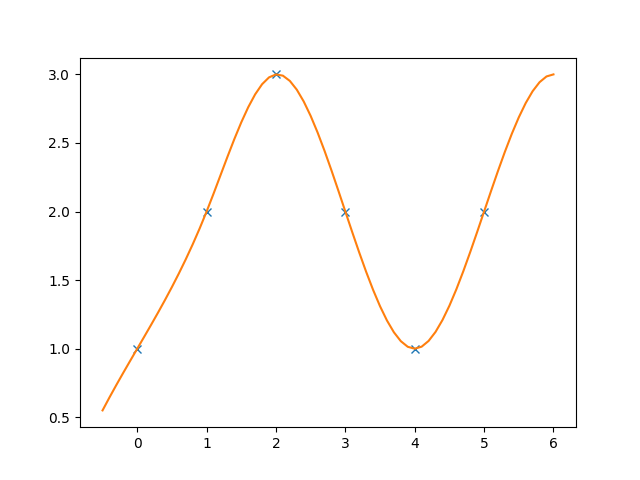

# Cubic splines for C++

![C++11][cxx-badge]
[![Boost License][license-badge]](LICENSE.txt)



Header-only cubic spline interpolator for C++11 and above.

[cxx-badge]: https://img.shields.io/badge/C%2B%2B-11-orange.svg
[license-badge]: https://img.shields.io/badge/license-Boost-blue.svg

- [Usage](#usage)
- [License](#license)

## Prerequisites

Catch (standard Linux package from the package manager):

```
sudo apt install catch
```

## Usage

It's just the header `cxx-spline.hpp` which you need. Either
use `make install` to install it on your system or just copy
the header into your project directory.

### Installing the header on your system
```
cmake .
make
make test
sudo make install
```
or

### Copy [cxx-spline.hpp](cxx-spline.hpp) into your include directory.

### Use `cubic_spline` class like this

```c++
#include <vector>
#include <cxx-spline.hpp>

int main()
{
    // Some points (t,y) on a curve y = f(t)
    std::vector<double> t = { 0, 1, 2, 3, 4, 5 };
    std::vector<double> y = { 1, 2, 3, 2, 1, 2 };

    // Spline interpolation (and extrapolation) of the points
    cubic_spline spline(t, y);

    spline(0.5); // 1.44976
    spline(1.5); // 2.65072
    spline(6.0); // 3
}
```

To interpolate a 2D (or higher dimensional) curve, just create splines for each
coordinate values. Example:

```c++
#include <iostream>
#include <vector>
#include <cxx-spline.hpp>

int main()
{
    // Samples from a circle.
    std::vector<double> t = { 0, 0.25, 0.5, 0.75, 1 };
    std::vector<double> x = { 1, 0, -1, 0, 1 };
    std::vector<double> y = { 0, 1, 0, -1, 0 };

    // Spline interpolation of each coordinate.
    cubic_spline spline_x(t, x);
    cubic_spline spline_y(t, y);

    for (int i = 0; i <= 100; i++) {
        double sx = spline_x(i / 100.0);
        double sy = spline_y(i / 100.0);
        std::cout << sx << '\t' << sy << '\n';
    }
}
```
See again the demo directory for this example in action.

## Boundary conditions

The `cubic_spline` class supports natural and not-a-knot boundary conditions.
Pass `cubic_spline::natural` or `cubic_spline::not_a_knot` to the constructor
to choose the boundary conditions. Natural is the default.

```c++
cubic_spline natural_spline(t, x, cubic_spline::natural);
cubic_spline notaknot_spline(t, x, cubic_spline::not_a_knot);
```

The *natural* (or free-end) spline gives the minimum-energy curve in a certain
physical sense. The *not-a-knot* spline gives a smoother-looking curve when
used for visualization.


## Testing

```sh
cmake .
make
make test
```

## License

Boost Software License, Version 1.0.
